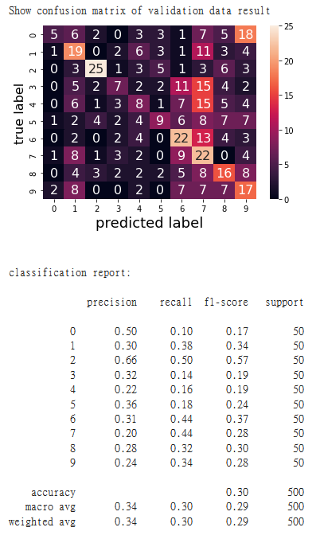
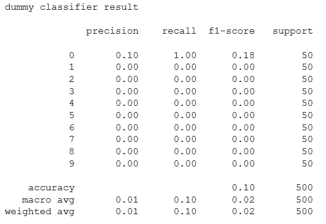

# imagewoof_resnet18

 
Google Colab link: https://colab.research.google.com/drive/1i7TutHdMP3ZeqUhl8n1XI1e8fn9Ei7FU?usp=sharing
 
Training loss
 

 
 
Result using resnet18 to classify Imagewoof dataset (accuracy:0.3)
 

 
 
Result of DummyClassifier using "most_frequent" (accuracy:0.09)
 

 
 
References: https://www.kaggle.com/pintu161/transfer-learning-in-pytorch-using-resnet18

