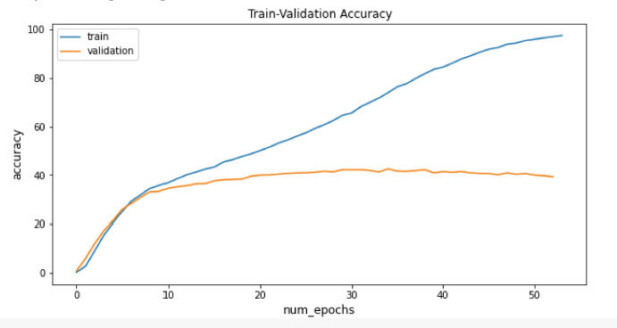
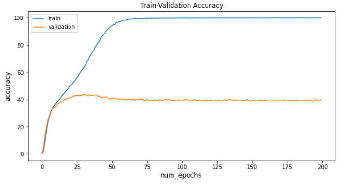
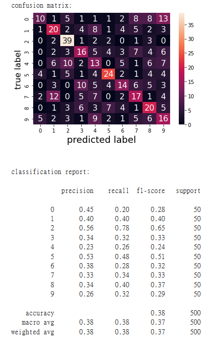

# imagewoof_resnet18

 
Google Colab link: https://colab.research.google.com/drive/12_oakMuvnZXgLC0ApXXzDQAF2I96HVHh?usp=sharing
 
 
Training Accuracy
 

 
 
Result using resnet18 to classify Imagewoof dataset (accuracy:0.38)
 

 
 
Result of DummyClassifier using "most_frequent" (accuracy:0.1)
 

 
 
References:

[1] https://www.kaggle.com/pintu161/transfer-learning-in-pytorch-using-resnet18

[2] https://www.pluralsight.com/guides/introduction-to-resnet

